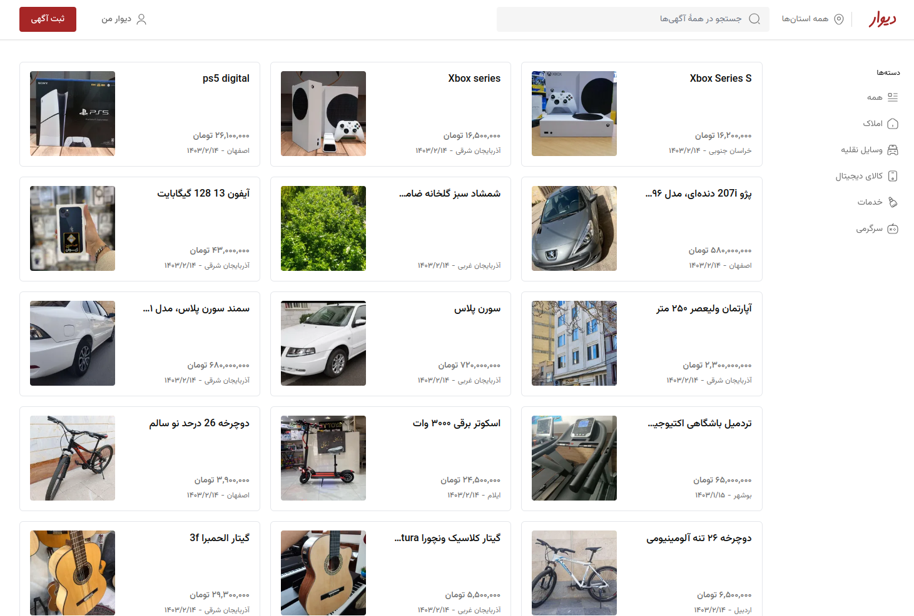

  

## Attention!
- Please clone <a target="_blank" href="https://github.com/HadiKia/divar-api">this repository</a> and run the command **npm start** before executing the project to connect to the backend and view the otp code in the backend project terminal.

---

# Divar project!

## [review online](https://divar-app.netlify.app/)

---

## Features

- Authentication & Authorization
- Admin & User panel (admin mobile: 09102223322)
- Add & remove category (admin rule)
- Add & remove post
- Search posts
- Filter posts
- Post details page
- SPA app
- Login / Logout

---

## Tips

- Fully responsive for mobile, tablet, laptop and desktop

---

## Web development technologies

- React JS
- React Query
- axios
- Tailwind CSS
- Headless UI
- React router dom (v6)
- React hot toast
- React loading

---

## Contact me

